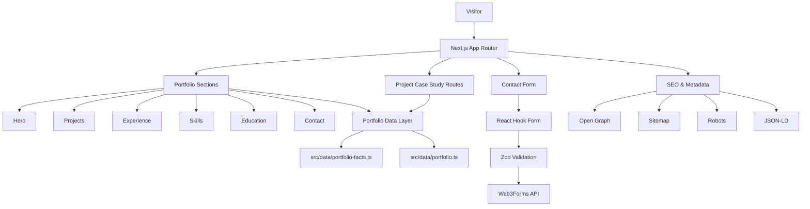
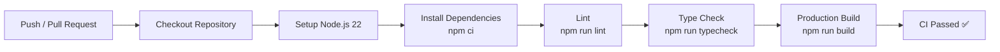
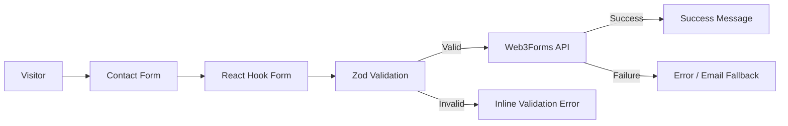
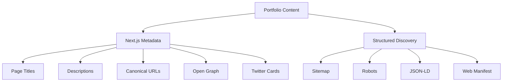
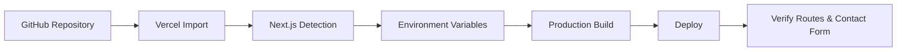
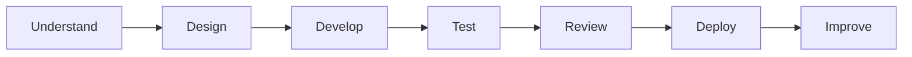

<div align="center">


# Md. Nazmus Shakib — Developer Portfolio

### Backend Developer · Laravel · PHP · MySQL · REST APIs

A cinematic, production-ready developer portfolio built with **Next.js 16, React 19, TypeScript, Tailwind CSS v4 and Motion**.

<br/>

[](https://nextjs.org/)
[](https://react.dev/)
[](https://www.typescriptlang.org/)
[](https://tailwindcss.com/)
[](https://vercel.com/)

<br/>

[](https://github.com/nazmusshakib878)
[](https://www.linkedin.com/in/mdnazmusshakib878/)
[](mailto:nazmusshakib335@gmail.com)
[](https://wa.me/8801716333670?text=Hello%20Nazmus%2C%20I%20visited%20your%20portfolio%20and%20would%20like%20to%20connect.)

</div>

---

## 📌 Table of Contents

- [Overview](#-overview)
- [Quick Links](#-quick-links)
- [Project Gallery](#️-project-gallery)
- [Core Features](#-core-features)
- [Tech Stack](#-tech-stack)
- [Application Architecture](#-application-architecture)
- [Project Structure](#-project-structure)
- [Featured Projects](#-featured-projects)
- [Experience](#-experience)
- [Education](#-education)
- [Certification & Highlights](#-certification--highlights)
- [Local Development](#️-local-development)
- [Available Scripts](#-available-scripts)
- [Continuous Integration](#-continuous-integration)
- [Contact Form Workflow](#-contact-form-workflow)
- [Security](#-security)
- [Accessibility](#-accessibility)
- [Performance & Optimization](#-performance--optimization)
- [SEO](#-seo)
- [Deployment](#-deployment)
- [Updating Portfolio Content](#️-updating-portfolio-content)
- [Quality Check](#-quality-check-before-handoff)
- [Development Workflow](#️-development-workflow)
- [Future Improvements](#-future-improvements)
- [License](#-license)
- [Connect With Me](#-connect-with-me)

---

## ✨ Overview

This portfolio showcases my work as a **Backend Developer** focused on building reliable, database-driven web applications with **Laravel, PHP, MySQL, authentication, REST APIs and modern frontend integration**.

The website uses an editorial dark visual system, subtle motion, accessible interactions, optimized project visuals, dedicated case-study routes, SEO metadata and a production-ready contact experience.

### Quick Profile

| | |
|---|---|
| **Name** | Md. Nazmus Shakib |
| **Primary Role** | Backend Developer |
| **Location** | Khulna, Bangladesh |
| **Academic Status** | Final-semester BSc CSE student |
| **Current CGPA** | 3.60 / 4.00 |
| **Expected Graduation** | November 2026 |
| **Laravel Training** | 80 Hours |
| **Availability** | Open to new opportunities |

---

## 🔗 Quick Links

- **GitHub Profile:** https://github.com/nazmusshakib878
- **LinkedIn:** https://www.linkedin.com/in/mdnazmusshakib878/
- **AI Smart Campus Live Demo:** https://ai-smart-campus-system-ce9i.onrender.com/
- **Email:** nazmusshakib335@gmail.com
- **WhatsApp:** +8801716333670

---

## 🖼️ Project Gallery

<table>
  <tr>
    <td width="50%" align="center">
      
      <br/>
      <strong>Securex</strong>
      <br/>
      <sub>CCTV & Security Service Management System</sub>
    </td>
    <td width="50%" align="center">
      
      <br/>
      <strong>AI Smart Campus System</strong>
      <br/>
      <sub>AI-powered academic management platform</sub>
    </td>
  </tr>
  <tr>
    <td width="50%" align="center">
      
      <br/>
      <strong>Library Management Project</strong>
      <br/>
      <sub>Laravel MVC academic project</sub>
    </td>
    <td width="50%" align="center">
      
      <br/>
      <strong>Logistica</strong>
      <br/>
      <sub>Transport & courier workflow platform</sub>
    </td>
  </tr>
</table>

> The repository currently includes optimized project cover assets. A real full-page portfolio screenshot can be added later when available.

---

## 🚀 Core Features

### Portfolio Experience

- Cinematic editorial dark interface
- Responsive desktop, tablet and mobile layouts
- Real profile portrait with subtle interactive depth
- Smooth section reveal animations
- Intro loading experience
- Custom desktop cursor
- Responsive navigation
- Social rail on supported desktop widths
- Downloadable resume
- Project case-study routes
- Interactive skills explorer
- Project slider with dedicated navigation

### Contact Experience

- React Hook Form
- Zod validation
- Web3Forms submission
- Honeypot anti-spam field
- Success and error feedback
- Clear fallback when contact delivery is not configured

### Production & SEO

- Open Graph image
- Twitter card metadata
- Canonical URLs
- JSON-LD structured data
- Sitemap generation
- Robots metadata
- Web manifest
- Dynamic project metadata
- GitHub Actions CI
- Security headers

---

## 🧰 Tech Stack

### Portfolio Application

| Layer | Technologies |
|---|---|
| **Framework** | Next.js 16 |
| **Frontend** | React 19 |
| **Language** | TypeScript |
| **Styling** | Tailwind CSS v4 |
| **Animation** | Motion |
| **Forms** | React Hook Form |
| **Validation** | Zod |
| **Contact Delivery** | Web3Forms |
| **Icons** | Lucide React, React Icons |
| **Linting** | Oxlint |
| **CI** | GitHub Actions |
| **Deployment** | Vercel-ready |

### Development Skills Highlighted

<p>


</p>

**Backend:** Laravel 12 · PHP · Laravel Sanctum · RESTful APIs · MVC · Authentication · Middleware · Google OAuth 2.0 · Role-Based Access Control

**Database:** MySQL · Eloquent ORM · Relational Schema Design · Database Normalization · SQL · Database Integrity

**Frontend:** React · Vite · Tailwind CSS · Bootstrap · Material UI · HTML5 · CSS3

**AI Integration:** Gemini API · OpenAI API · Hugging Face API Integration

**Tools & Practices:** Git · GitHub · Postman · VS Code · SMTP · PDF Invoice Generation · SDLC · Agile · Scrum · Testing · Debugging · Technical Documentation

---

## 🧩 Application Architecture



---

## 📁 Project Structure

```text
nazmusshakib878-portfolio/
├── public/
│   ├── images/
│   │   └── profile.png
│   ├── projects/
│   │   ├── securex-cover-v2.webp
│   │   ├── ai-smart-campus-cover-v2.webp
│   │   ├── library-management-cover-v2.webp
│   │   └── logistica-cover-v3.webp
│   └── resume.pdf
│
├── src/
│   ├── app/
│   │   ├── page.tsx
│   │   ├── layout.tsx
│   │   ├── loading.tsx
│   │   ├── error.tsx
│   │   ├── not-found.tsx
│   │   ├── manifest.ts
│   │   ├── robots.ts
│   │   ├── sitemap.ts
│   │   ├── opengraph-image.tsx
│   │   └── projects/
│   │       └── [slug]/
│   │           └── page.tsx
│   │
│   ├── components/
│   │   ├── layout/
│   │   ├── sections/
│   │   └── ui/
│   │
│   ├── constants/
│   ├── data/
│   ├── lib/
│   └── types/
│
├── .github/
│   └── workflows/
│       └── ci.yml
│
├── .env.example
├── next.config.ts
├── package.json
├── postcss.config.mjs
└── tsconfig.json
```

---

# 💼 Featured Projects

## 1. Securex — CCTV & Security Service Management System

An end-to-end Laravel MVC platform designed to simplify security service discovery, bookings, administrative review, status management, notifications and invoice workflows.

### Key Features

- Email/password authentication
- Google OAuth 2.0
- Role-based administration
- Dynamic service CRUD
- Client service booking
- Administrative booking review
- Booking status updates
- Automated email notifications
- PDF invoice generation
- Time-slot conflict detection
- Alternative available-slot recommendations
- Duplicate-booking prevention

### Technologies

`PHP` · `Laravel` · `MySQL` · `Laravel MVC` · `Google OAuth 2.0` · `SMTP` · `PDF Generation`

**Repository:** https://github.com/nazmusshakib878/Securex

---

## 2. AI Smart Campus System

An AI-powered academic management and student-success platform developed as an academic team project.

### My Role

**Team Leader & Database Lead**

### Key Features

- Led the academic project team
- Designed and coordinated the MySQL-backed data layer
- React + Vite frontend
- Laravel 12 REST API
- Laravel Sanctum authentication
- Academic and student-management workflows
- AI-assisted campus features

### Technologies

`React` · `Vite` · `Laravel 12` · `Laravel Sanctum` · `MySQL` · `RESTful API` · `AI API Integration`

**Repository:** https://github.com/nazmusshakib878/CSE4204-8A-T07-ai-smart-campus-system

**Live Demo:** https://ai-smart-campus-system-ce9i.onrender.com/

---

## 3. Library Management Project

A Laravel academic project demonstrating database-backed library workflows and structured MVC development.

### Key Features

- Laravel application logic
- MVC architecture
- Database-backed workflows
- Core library operations
- CRUD functionality
- GitHub-based source management

### Technologies

`PHP` · `Laravel` · `MySQL` · `MVC` · `CRUD`

**Repository:** https://github.com/nazmusshakib878/Library-management-project

---

## 4. Logistica

A country-to-country transport, courier and supply-shipment management system developed collaboratively during an internship.

### Contributions

- Supported Laravel and PHP implementation
- Worked with reusable application logic
- Assisted with debugging and troubleshooting
- Performed database integrity checks
- Used Git and GitHub collaboratively

### Technologies

`PHP` · `Laravel` · `MySQL` · `Git` · `GitHub`

**Repository:** https://github.com/nazmusshakib878/Logistica

---

# 🧑‍💻 Experience

## Backend Developer Intern — Appstick Tech Firm

**Period:** February 2026 – March 2026  
**Location:** Khulna, Bangladesh

Worked collaboratively on the **Logistica** project, supporting Laravel/PHP implementation, reusable application logic, debugging, database integrity and Git/GitHub workflows.

---

# 🎓 Education

## Bachelor of Science in Computer Science and Engineering

**Northern University of Business and Technology Khulna (NUBTK)**

- Final year, final semester
- Current CGPA: **3.60 / 4.00**
- Expected graduation: **November 2026**

### Relevant Coursework

- Distributed Databases
- Software Architecture and Design
- Advanced Data Structures
- Network Routing Protocols

---

## Higher Secondary Certificate — Science

**Satkhira Government College**

- Year: 2020
- GPA: **5.00 / 5.00**

---

## Secondary School Certificate — Science

**Alipur Union Secondary School**

- Year: 2018
- GPA: **5.00 / 5.00**

---

# 🏆 Certification & Highlights

## PHP (Laravel) Training — 80 Hours

Structured Laravel training under the **EDGE Project, Bangladesh Computer Council and ICT Division**.

### Covered Topics

- Laravel MVC architecture
- Authentication
- Middleware
- CRUD development
- Relational schema design
- MySQL
- SQL
- Backend application development

### Additional Highlights

- Current CGPA: **3.60 / 4.00**
- Team Leader & Database Lead — AI Smart Campus System
- GPA 5.00 in both HSC and SSC
- 80 hours of formal Laravel training

---

# ⚙️ Local Development

## Prerequisites

Before starting, make sure your system has:

- **Node.js 22** recommended
- **npm**
- **Git**

---

## 1. Clone the Repository

```bash
git clone <YOUR_REPOSITORY_URL>
cd <YOUR_REPOSITORY_FOLDER>
```

> Replace the placeholders with the final URL and local folder name of this portfolio repository.

---

## 2. Install Dependencies

```bash
npm install
```

---

## 3. Create the Environment File

### Windows

```bash
copy .env.example .env.local
```

### macOS / Linux

```bash
cp .env.example .env.local
```

---

## 4. Configure Environment Variables

```env
NEXT_PUBLIC_SITE_URL=http://localhost:3000
NEXT_PUBLIC_WEB3FORMS_ACCESS_KEY=your_web3forms_access_key
```

### Environment Variable Reference

| Variable | Purpose |
|---|---|
| `NEXT_PUBLIC_SITE_URL` | Canonical site URL used for metadata and production links |
| `NEXT_PUBLIC_WEB3FORMS_ACCESS_KEY` | Web3Forms key used for contact-form delivery |

> Never commit real private credentials or production secrets to GitHub.

---

## 5. Start Development Server

```bash
npm run dev
```

Then open:

```text
http://localhost:3000
```

---

# 📜 Available Scripts

| Command | Description |
|---|---|
| `npm run dev` | Start the development server |
| `npm run lint` | Run Oxlint checks |
| `npm run typecheck` | Run TypeScript validation |
| `npm run build` | Create the production build |
| `npm start` | Start the production server |
| `npm run check` | Run lint + typecheck + build |

---

# 🔄 Continuous Integration

GitHub Actions automatically checks the project on every **push** and **pull request**.



### CI Quality Gates

```text
Code pushed
   │
   ▼
Dependencies installed
   │
   ▼
Lint passes
   │
   ▼
TypeScript passes
   │
   ▼
Production build succeeds
   │
   ▼
Ready for review / deployment
```

---

# 📬 Contact Form Workflow



---

# 🔐 Security

The portfolio configures multiple response-level protections.

- Content Security Policy
- Referrer Policy
- `X-Content-Type-Options`
- `X-Frame-Options`
- Permissions Policy
- Cross-Origin Opener Policy
- Production HSTS
- Disabled `X-Powered-By`
- Contact-form validation
- Honeypot spam protection

---

# ♿ Accessibility

The portfolio includes accessibility-focused behavior such as:

- Keyboard-accessible navigation
- Visible focus states
- Skip-to-content support
- Reduced-motion handling
- Mobile touch behavior
- Improved contrast
- Responsive layouts
- Accessible project navigation

The documented design QA also reports no serious/critical Axe findings in the audited layouts.

---

# ⚡ Performance & Optimization

Key optimization work includes:

- Optimized WebP project covers
- More than 96% reduction in project-cover asset size during the documented optimization pass
- Reduced unnecessary slider geometry work
- Responsive image loading
- Subtle motion rather than heavy animation
- No documented horizontal overflow in audited layouts
- No documented missing project images or console errors after the QA pass

---

# 🔍 SEO

The project includes a complete metadata foundation:



### Included SEO Features

- Metadata API
- Canonical URLs
- Dynamic Open Graph image
- Twitter card metadata
- Person JSON-LD
- Sitemap
- Robots metadata
- Manifest
- Project-specific metadata

---

# 🚀 Deployment

The application is ready for deployment on **Vercel**.

## Deployment Flow



## Required Environment Variables

```env
NEXT_PUBLIC_SITE_URL=https://your-domain.com
NEXT_PUBLIC_WEB3FORMS_ACCESS_KEY=your_web3forms_access_key
```

### After Deployment Verify

- Homepage
- Navigation
- Project case-study routes
- Project images
- Resume download
- Contact form
- Open Graph metadata
- Sitemap
- Robots
- Mobile responsiveness

---

# ✏️ Updating Portfolio Content

Most factual portfolio information is centralized here:

```text
src/data/portfolio-facts.ts
```

The application consumes consolidated data through:

```text
src/data/portfolio.ts
```

### Important Asset Locations

| Content | Path |
|---|---|
| Profile image | `public/images/profile.png` |
| Resume | `public/resume.pdf` |
| Project covers | `public/projects/*.webp` |
| Hero visual | `src/components/sections/hero-visual.tsx` |
| Main portfolio data | `src/data/portfolio-facts.ts` |
| Social links | `src/constants/social-links.ts` |

---

# 🧪 Quality Check Before Handoff

Run:

```bash
npm run lint
npm run typecheck
npm run build
```

Or run everything together:

```bash
npm run check
```

---

# 🗺️ Development Workflow



---

# 📈 Future Improvements

Potential future additions:

- Add the final deployed portfolio URL
- Add a real full-page homepage screenshot
- Add project-specific screenshots
- Add demo GIFs or short videos
- Add a custom production domain
- Add automated Lighthouse checks
- Add more production case studies
- Add automated dependency/security checks
- Add unit/integration tests where appropriate

---

# 📄 License

A dedicated `LICENSE` file is not currently included in the repository.

If this project is intended to be open source, add a license that clearly defines reuse, modification and distribution permissions.

---

# 🤝 Connect With Me

<div align="center">

[](https://github.com/nazmusshakib878)
[](https://www.linkedin.com/in/mdnazmusshakib878/)
[](mailto:nazmusshakib335@gmail.com)
[](https://wa.me/8801716333670?text=Hello%20Nazmus%2C%20I%20visited%20your%20portfolio%20and%20would%20like%20to%20connect.)

<br/>

### Building reliable systems with thoughtful interfaces.

**Md. Nazmus Shakib**  
Backend Developer · Khulna, Bangladesh

</div>
