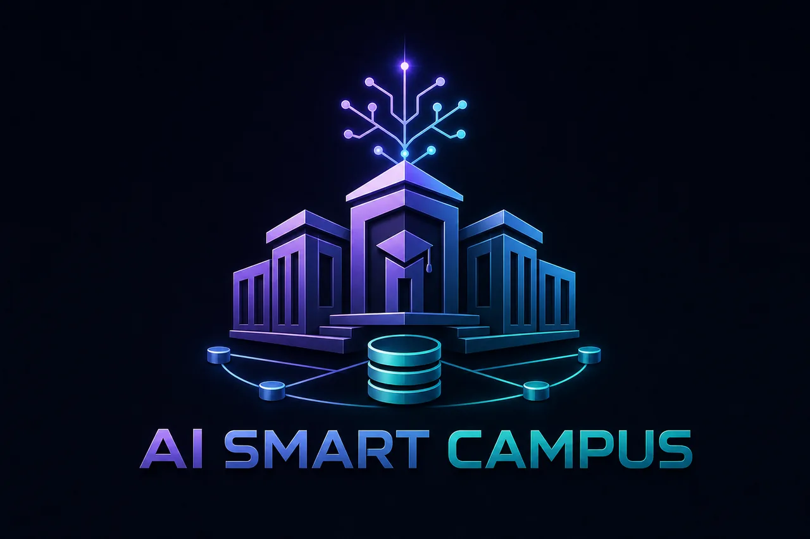
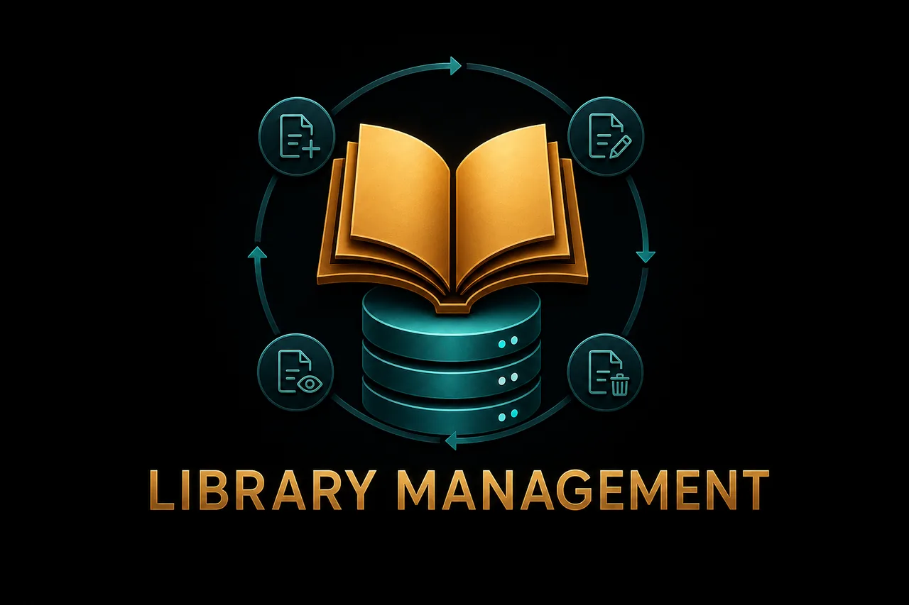
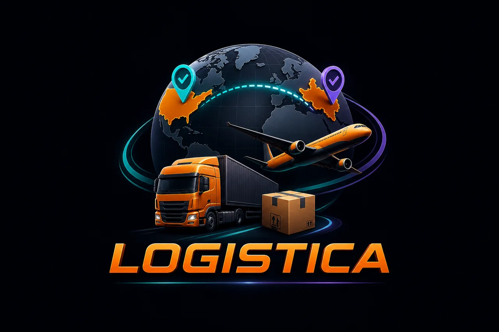

<div align="center">


# Md. Nazmus Shakib — Developer Portfolio

### Backend Developer · Laravel · PHP · MySQL · REST APIs

A production-ready cinematic portfolio built with **Next.js, React, TypeScript, Tailwind CSS and Motion** to showcase real projects, backend expertise, academic work, technical skills, experience and contact information.

[](https://nextjs.org/)
[](https://react.dev/)
[](https://www.typescriptlang.org/)
[](https://tailwindcss.com/)
[](https://vercel.com/)

[GitHub](https://github.com/nazmusshakib878) · [LinkedIn](https://www.linkedin.com/in/mdnazmusshakib878/) · [AI Smart Campus Live Demo](https://ai-smart-campus-system-ce9i.onrender.com/) · [Email](mailto:nazmusshakib335@gmail.com)

</div>

---

## About This Portfolio

This portfolio presents my work as a **Backend Developer** focused on **Laravel, PHP, MySQL, relational databases, authentication, RESTful APIs and reliable application workflows**.

It combines a responsive editorial dark interface with subtle motion, real project case studies, a skills explorer, experience and education sections, downloadable resume support, SEO metadata and a validated contact experience.

* **Developer:** Md. Nazmus Shakib
* **Role:** Backend Developer
* **Location:** Khulna, Bangladesh
* **Status:** Open to new opportunities
* **Academic Status:** Final-semester BSc CSE student
* **Expected Graduation:** November 2026

---

## Project Preview

<table>
  <tr>
    <td width="50%" align="center">
      
      <br><strong>Securex</strong>
    </td>
    <td width="50%" align="center">
      
      <br><strong>AI Smart Campus System</strong>
    </td>
  </tr>
  <tr>
    <td width="50%" align="center">
      
      <br><strong>Library Management Project</strong>
    </td>
    <td width="50%" align="center">
      
      <br><strong>Logistica</strong>
    </td>
  </tr>
</table>

> Add a real homepage screenshot later as `public/portfolio-preview.webp` if you want a full-width portfolio preview at the top of this README.

---

## Key Features

* Cinematic editorial dark-mode design
* Fully responsive navigation and layouts
* Real profile portrait with subtle interactive depth
* Motion-powered section reveals and intro loader
* Custom desktop cursor
* Horizontal featured-project slider
* Dedicated project case-study pages
* Interactive skills and technology explorer
* Experience, education, certification and achievements sections
* Downloadable resume
* React Hook Form + Zod contact validation
* Web3Forms contact delivery
* Honeypot spam protection
* Contact fallback when provider configuration is missing
* Open Graph image and per-project metadata
* Sitemap, robots, manifest and JSON-LD
* Reduced-motion support
* Security headers and Content Security Policy
* GitHub Actions CI for lint, typecheck and build

---

## Tech Stack

| Area       | Technologies                            |
| ---------- | --------------------------------------- |
| Framework  | Next.js 16, React 19                    |
| Language   | TypeScript                              |
| Styling    | Tailwind CSS v4                         |
| Motion     | Motion                                  |
| Forms      | React Hook Form                         |
| Validation | Zod                                     |
| Contact    | Web3Forms                               |
| Icons      | Lucide React, React Icons               |
| Quality    | Oxlint, TypeScript checks               |
| CI/CD      | GitHub Actions, Vercel-ready deployment |

### Backend & Development Skills Highlighted

`Laravel 12` · `PHP` · `MySQL` · `Eloquent ORM` · `REST APIs` · `Laravel Sanctum` · `MVC` · `Authentication` · `Middleware` · `Google OAuth 2.0` · `Role-Based Access Control` · `React` · `Vite` · `Git` · `GitHub` · `Postman` · `Gemini API` · `OpenAI API` · `Hugging Face API Integration`

---

## Featured Projects

### 1. Securex — CCTV & Security Service Management System

A Laravel MVC platform for security-service discovery, client bookings, administrative review, scheduling, communication and invoice workflows.

**Highlights:** authentication, Google OAuth 2.0, role-based administration, service CRUD, booking review, status updates, email notifications, PDF invoices, time-slot conflict detection and duplicate-booking prevention.

**Tech:** Laravel · PHP · MySQL · Google OAuth 2.0 · SMTP · PDF Generation

[View Repository](https://github.com/nazmusshakib878/Securex)

### 2. AI Smart Campus System

An AI-powered academic management and student-success platform built as an academic team project.

**Role:** Team Leader & Database Lead

**Highlights:** React/Vite frontend, Laravel 12 REST API, Laravel Sanctum authentication, MySQL-backed workflows and AI-assisted campus features.

**Tech:** React · Vite · Laravel 12 · Laravel Sanctum · MySQL · REST API · AI Integration

[View Repository](https://github.com/nazmusshakib878/CSE4204-8A-T07-ai-smart-campus-system) · [Live Demo](https://ai-smart-campus-system-ce9i.onrender.com/)

### 3. Library Management Project

A Laravel academic project demonstrating structured MVC development, CRUD operations and database-backed library workflows.

**Tech:** PHP · Laravel · MySQL · MVC · CRUD

[View Repository](https://github.com/nazmusshakib878/Library-management-project)

### 4. Logistica

A country-to-country transport, courier and supply-shipment management project developed collaboratively during a backend-development internship.

**Contributions:** Laravel/PHP implementation support, reusable logic, debugging, database-integrity checks and collaborative Git/GitHub workflow.

**Tech:** PHP · Laravel · MySQL · Git · GitHub

[View Repository](https://github.com/nazmusshakib878/Logistica)

---

## Project Structure

```text
.
├── public/
│   ├── images/profile.png
│   ├── projects/
│   │   ├── securex-cover-v2.webp
│   │   ├── ai-smart-campus-cover-v2.webp
│   │   ├── library-management-cover-v2.webp
│   │   └── logistica-cover-v3.webp
│   └── resume.pdf
├── src/
│   ├── app/
│   │   └── projects/[slug]/
│   ├── components/
│   │   ├── layout/
│   │   ├── sections/
│   │   └── ui/
│   ├── constants/
│   ├── data/
│   ├── lib/
│   └── types/
├── .github/workflows/ci.yml
├── .env.example
├── next.config.ts
├── package.json
└── tsconfig.json
```

---

## Getting Started

### Prerequisites

* Node.js 22 recommended
* npm
* Git

### Clone

```bash
git clone <YOUR_PORTFOLIO_REPOSITORY_URL>
cd <YOUR_PORTFOLIO_REPOSITORY_FOLDER>
```

> Replace the placeholders above with the final GitHub repository URL and folder name.

### Install Dependencies

```bash
npm install
```

### Create Environment File

**Windows**

```bash
copy .env.example .env.local
```

**macOS / Linux**

```bash
cp .env.example .env.local
```

### Environment Variables

```env
NEXT_PUBLIC_SITE_URL=http://localhost:3000
NEXT_PUBLIC_WEB3FORMS_ACCESS_KEY=your_web3forms_access_key
```

### Run Development Server

```bash
npm run dev
```

Open `http://localhost:3000`.

---

## Available Scripts

```bash
npm run dev        # Development server
npm run lint       # Oxlint
npm run typecheck  # TypeScript validation
npm run build      # Production build
npm start          # Start production server
npm run check      # Lint + typecheck + build
```

---

## Contact Form

The contact section uses **React Hook Form + Zod + Web3Forms** and includes:

* Name
* Email
* Subject
* Message
* Hidden honeypot field
* Success/error status feedback
* Email fallback when Web3Forms is not configured

> Do not commit real credentials or private secrets to the repository.

---

## SEO & Metadata

The portfolio includes:

* Next.js Metadata API
* Canonical URL support
* Dynamic Open Graph image
* Twitter card metadata
* JSON-LD `Person` structured data
* Dynamic sitemap
* Robots metadata
* Web manifest
* Per-project metadata and OG previews

---

## Security

Configured response protections include:

* Content Security Policy
* Referrer Policy
* `X-Content-Type-Options`
* `X-Frame-Options`
* Permissions Policy
* Cross-Origin Opener Policy
* HSTS in production
* Disabled `X-Powered-By` header

---

## Accessibility & Performance

The portfolio has been audited across mobile, tablet, laptop and desktop layouts.

Important improvements include:

* Keyboard navigation and visible focus states
* Skip-to-content link
* Reduced-motion behavior
* Responsive touch behavior
* Improved contrast
* No audited horizontal overflow
* Accessible project and skills interactions
* Optimized WebP project covers
* Project cover size reduced by more than 96% during optimization
* No serious/critical Axe findings in the documented audit

---

## Continuous Integration

GitHub Actions runs on pushes and pull requests using Node.js 22.

```text
Checkout
  ↓
npm ci
  ↓
Lint
  ↓
Typecheck
  ↓
Production Build
```

---

## Deployment

The project is ready for **Vercel**.

1. Push the repository to GitHub.
2. Import it into Vercel.
3. Keep the detected Next.js preset.
4. Configure:

```env
NEXT_PUBLIC_SITE_URL=https://your-domain.com
NEXT_PUBLIC_WEB3FORMS_ACCESS_KEY=your_key
```

5. Deploy.
6. Verify the home page, project routes, images, resume, contact form, metadata and sitemap.

---

## Updating Portfolio Content

Main factual content:

```text
src/data/portfolio-facts.ts
```

Consolidated data facade:

```text
src/data/portfolio.ts
```

Important assets:

```text
Profile        → public/images/profile.png
Resume         → public/resume.pdf
Project covers → public/projects/*.webp
Hero visual    → src/components/sections/hero-visual.tsx
```

---

## Connect With Me

<p align="left">
  <a href="https://github.com/nazmusshakib878"></a>
  <a href="https://www.linkedin.com/in/mdnazmusshakib878/"></a>
  <a href="mailto:nazmusshakib335@gmail.com"></a>
  <a href="https://wa.me/8801716333670?text=Hello%20Nazmus%2C%20I%20visited%20your%20portfolio%20and%20would%20like%20to%20connect."></a>
</p>

**Email:** [nazmusshakib335@gmail.com](mailto:nazmusshakib335@gmail.com)
**Location:** Khulna, Bangladesh

---

## Future Improvements

* Add the final deployed portfolio URL to the hero links
* Add a real full-page homepage screenshot
* Add project-specific screenshots or demo GIFs
* Add a custom domain
* Add automated Lighthouse checks to CI
* Add new production case studies over time

---

## License

No dedicated `LICENSE` file is currently included. Add one if you want to define reuse, modification and distribution permissions for the source code.

---

<div align="center">

### Built with a focus on reliable systems, thoughtful interfaces and real project work.

**Md. Nazmus Shakib** · Backend Developer · Khulna, Bangladesh

</div>
